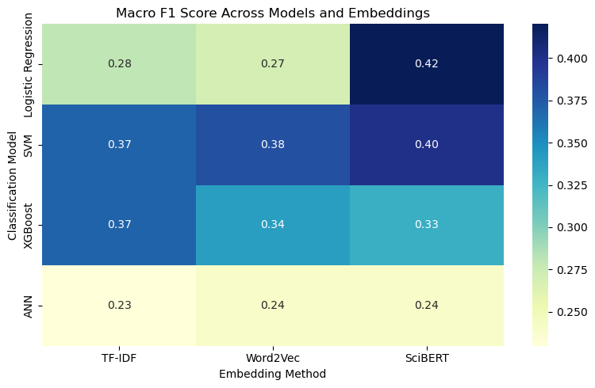

# Comparative Study of Traditional Machine Learning, Deep Learning, and Transformer-Based Models for Text Classification
## Project Overview
This project focuses on a comparative analysis of different text representation techniques and machine learning models for a multi-class text classification task (Yes / No / Maybe).

We explore traditional methods such as TF-IDF and Word2Vec, as well as contextual embeddings generated using BERT. These representations are evaluated using multiple classifiers including Logistic Regression, Support Vector Machine (SVM), XGBoost, and an Artificial Neural Network (ANN). Additionally, a fine-tuned BERT model is used to assess the performance of transformer-based approaches.

The study aims to understand how different feature extraction methods and models influence classification performance on the same dataset.
## Objectives

- To compare TF-IDF, Word2Vec, and BERT-based text representations.
- To evaluate the performance of classical machine learning models such as Logistic Regression, SVM, and XGBoost.
- To implement and assess a deep learning-based Artificial Neural Network (ANN).
- To fine-tune a pretrained BERT model for text classification.
- To analyze the impact of contextual embeddings versus traditional embeddings.
- To compare all models using standard evaluation metrics such as accuracy, precision, recall, and F1-score.

## Dataset

This project uses the **PubMedQA dataset**, a biomedical question answering dataset designed for research in natural language processing within the medical domain. The dataset is available at: https://pubmedqa.github.io/

PubMedQA consists of questions derived from PubMed abstracts, along with corresponding answers and contextual evidence. Each sample typically includes a biomedical question and a label indicating the answer type, commonly structured as **Yes / No / Maybe** for classification tasks.

The dataset is widely used for evaluating models on scientific and biomedical reasoning tasks, making it suitable for testing both traditional machine learning methods and advanced transformer-based models like BERT.

In this project, the dataset is used for multi-class text classification after appropriate preprocessing, where textual inputs are converted into numerical representations using TF-IDF, Word2Vec, and BERT embeddings before being passed to different classification models.

## Methodology

The project follows a structured pipeline for text classification:

### 1. Exploratory Data Analysis (EDA)
- Analysis of class distribution (Yes / No / Maybe)
- Inspection of text length variations
- Basic statistical and visual analysis of the dataset

### 2. Feature Extraction
- TF-IDF representation for sparse feature extraction
- Word2Vec embeddings for semantic representation
- BERT-based embeddings for contextual representation

### 3. Model Training
- Logistic Regression
- Support Vector Machine (SVM)
- XGBoost
- Artificial Neural Network (ANN)

### 4. Fine-Tuning
- Pretrained BERT model is fine-tuned on the labeled dataset for improved contextual understanding and classification performance

### 5. Evaluation
- Models are evaluated and compared using standard performance metrics such as accuracy, precision, recall, and F1-score

## Evaluation Metrics

The performance of all models is evaluated using the following metrics:

- Accuracy: Measures the proportion of correctly classified samples.
- Precision: Measures the correctness of positive predictions.
- Recall: Measures the ability of the model to identify all relevant instances.
- F1-Score: Harmonic mean of precision and recall, used for balanced evaluation.

These metrics are used to compare the effectiveness of different embeddings and models across the classification task.
## Results

The performance of different text representations and classification models was evaluated using accuracy, macro F1-score, macro recall and macro precision. Macro F1-score is particularly important in this study because the dataset exhibits class imbalance and some models struggled to correctly classify the minority "Maybe" class.

### Performance Summary

| Model | Embedding | Accuracy | Macro Precision | Macro Recall | Macro F1 |
|---------|------------|----------|----------|----------|----------|
| Logistic Regression | TF-IDF | 0.57 | 0.52 | 0.35 | 0.28 |
| Logistic Regression | Word2Vec | 0.56 | 0.41 | 0.35 | 0.27 |
| Logistic Regression | SciBERT Embeddings | 0.55 | 0.43 | 0.42 | 0.42 |
| SVM | TF-IDF | 0.58 | 0.37 | 0.39 | 0.37 |
| SVM | Word2Vec | 0.51 | 0.48 | 0.38 | 0.38 |
| SVM | SciBERT Embeddings | 0.52 | 0.40 | 0.40 | 0.40 |
| XGBoost | TF-IDF | 0.59 | 0.37 | 0.40 | 0.37 |
| XGBoost | Word2Vec | 0.50 | 0.32 | 0.36 | 0.34 |
| XGBoost | SciBERT Embeddings | 0.55 | 0.35 | 0.36 | 0.33 |
| ANN | TF-IDF | 0.36 | 0.30 | 0.33 | 0.23 |
| ANN | Word2Vec | 0.55 | 0.18 | 0.33 | 0.24 |
| ANN | SciBERT Embeddings | 0.55 | 0.18 | 0.33 | 0.24 |
| Fine-Tuned BERT | End-to-End | 0.56 | 0.36 | 0.40 | 0.38 |

## Macro F1 Heatmap

## Discussion

This study compared traditional text representations (TF-IDF and Word2Vec), contextual embeddings (SciBERT), and a fine-tuned BERT model across multiple machine learning and deep learning classifiers for the PubMedQA multi-class classification task. The results show that no single approach consistently outperformed all others across every metric. The highest accuracy was achieved by XGBoost with TF-IDF features (59%), followed closely by SVM with TF-IDF (58%), while fine-tuned BERT achieved a competitive accuracy of 56%, indicating that traditional machine learning methods remain strong baselines even compared to more complex deep learning and transformer-based approaches.

Overall, TF-IDF consistently performed well across Logistic Regression, SVM, and XGBoost, suggesting that lexical information and keyword-based signals are highly informative for this biomedical classification task. In contrast, Word2Vec embeddings generally underperformed, likely due to loss of contextual structure when aggregating word vectors into document-level representations. SciBERT embeddings showed mixed results; although they are context-aware, their benefits were not consistently reflected in downstream classifier performance, highlighting that richer embeddings do not automatically guarantee better classification outcomes when used as fixed feature inputs.

Among the traditional models, Logistic Regression and SVM showed stable and comparable performance, while XGBoost achieved the highest accuracy with TF-IDF due to its ability to capture non-linear relationships. However, the improvements over simpler models were relatively marginal, indicating that the dataset may be largely driven by strong lexical patterns rather than complex decision boundaries. The ANN model performed comparatively poorly, often biasing predictions toward the majority class, which suggests that the dataset size and feature quality were not sufficient to fully leverage deep neural architectures.

Fine-tuning BERT resulted in balanced performance and improved classification of minority classes compared to several baseline approaches. Unlike fixed embedding methods, fine-tuning allows the model to adapt its internal representations to the specific task, which contributed to its competitive performance despite not significantly surpassing TF-IDF-based models in accuracy.

A consistent challenge across all experiments was the poor performance on the “Maybe” class, which exhibited very low precision and recall across models. This is likely due to class imbalance, ambiguity in the class definition, and subtle linguistic differences that are difficult to capture. This further justifies the use of Macro F1-score as a more reliable evaluation metric than accuracy alone.

The initial hypothesis that contextual embeddings would outperform static embeddings (SciBERT > Word2Vec > TF-IDF) was not strongly supported by the results. Instead, TF-IDF often matched or outperformed embedding-based methods, reinforcing the importance of empirical evaluation over theoretical assumptions. Overall, the findings suggest that while transformer-based models offer powerful representation capabilities, traditional machine learning approaches remain highly competitive for biomedical text classification tasks, especially when data is limited and class imbalance is present.
## Limitations

This study has several limitations that may have influenced the results. The dataset size is relatively small, which limits the ability of complex models such as neural networks and transformers to fully learn robust patterns. There is also a noticeable class imbalance, particularly for the "Maybe" class, which leads to biased predictions toward the majority class and lowers macro-level performance. The ANN architecture used is relatively simple and may not fully capture complex patterns in the data. Finally, limited hyperparameter tuning was performed due to computational constraints, which may have affected the performance of models such as XGBoost and ANN.
